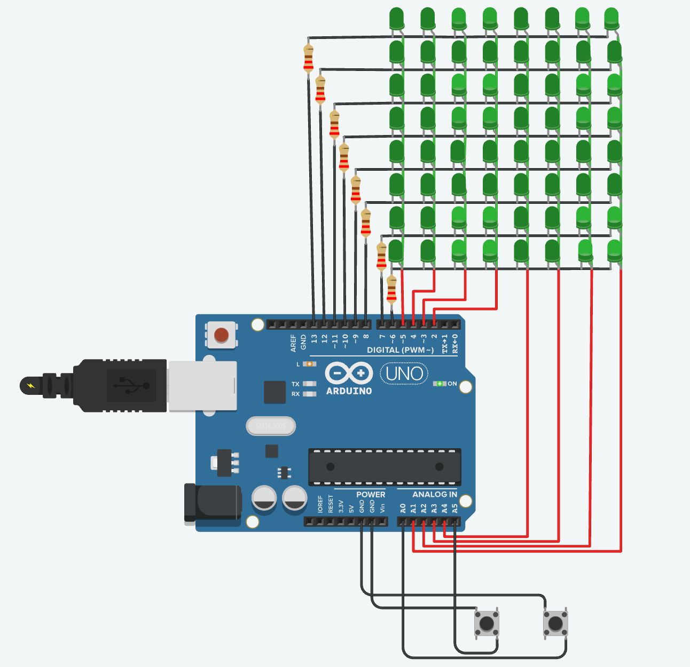

# Electronics and Embedded Systems

Collection of Arduino-based projects focused on control systems, embedded logic, and hardware interfacing.  
All projects are designed and simulated using Tinkercad.

## 1. Washing Machine
**What it Does:**  
Simulates a washing machine motor cycle using a bidirectional DC motor with controlled speed variation and cycle completion alerts.

**Core Idea:**  
Motor control using an H-bridge with PWM-based speed modulation.

**Components Used:**  
	•	Arduino  
	•	L293D H-bridge motor driver  
	•	DC motor  
	•	LED (status indication)  
	•	Buzzer  

**How it Works:**  
The L293D H-bridge enables bidirectional control of the DC motor, allowing it to switch between clockwise and counterclockwise rotation. PWM signals from the Arduino are used to gradually ramp motor speed up and down, mimicking washing cycles. LEDs indicate the state of operation, and a buzzer signals completion of the cycle.

**Features:**  
	•	Bidirectional motor control  
	•	PWM-based speed ramping  
	•	Visual status indication via LED  
	•	Audio alert on cycle completion  

## 2. 4-Function Calculator

**What it Does:**  
Implements a basic calculator capable of evaluating arithmetic expressions with correct operator precedence.

**Core Idea:**  
Expression parsing using the shunting-yard algorithm.

**Components Used:**  
	•	Arduino  
	•	4x4 keypad  
	•	16x2 LCD display (I2C)  

**How it Works:**  
User input is taken through the keypad and parsed using a stack-based shunting-yard algorithm to ensure correct operator precedence. The processed expression is evaluated and displayed on the LCD. The system dynamically detects the I2C address of the display and handles runtime errors such as division by zero. Results can be reused in subsequent calculations.

**Features:**  
	•	Correct operator precedence handling  
	•	Dynamic I2C address scanning  
	•	Division-by-zero error handling  
	•	Result chaining for continuous calculations  

## 3. Digital Piano

**What it Does:**  
Implements a minimal digital piano using an Arduino and piezo buzzer, mapping discrete button inputs to musical frequencies in real time.

**Core Idea:**  
Real-time mapping of discrete human input to frequency generation. 

**How it Works:**  
The system continuously scans button states in a polling loop. When a button is pressed, it triggers a corresponding frequency output through a piezo buzzer. The implementation prioritizes low latency over architectural complexity, ensuring immediate auditory feedback.

**Features:**  
	•	8-button real-time input system  
	•	Direct mapping of inputs to musical frequencies  
	•	Immediate sound generation using Arduino `tone()` function  

## 4. Tetris

**What it Does:**  
Implements a simplified Tetris-style game on an 8×8 LED matrix, including shape spawning, movement, rotation, collision detection, and line clearing.

**Core Idea:**  
Grid-based game logic mapped onto a multiplexed LED display with real-time input control.

**How it Works:**  
The system maintains an 8×8 board representing locked blocks and a separate 4×4 matrix for the active falling shape. Shapes are spawned at the top and descend at fixed time intervals. Movement is controlled via button inputs, while collision detection ensures shapes remain within bounds and do not overlap existing blocks.

The LED matrix is driven using row-column multiplexing. Each frame, rows are activated sequentially while corresponding column states are set to render both the static board and the active shape. This rapid scanning creates the perception of a continuous display.

When a shape can no longer move downward, it is locked into the board. The system then checks for fully filled rows, clears them, and shifts the board downward. New shapes are spawned, and the cycle repeats.

Rotation is implemented using a matrix transformation, with boundary and collision checks applied before committing the rotation.

**Features:**  
	•	8×8 LED matrix rendering via multiplexing  
	•	Real-time falling block system with adjustable speed  
	•	Collision detection for movement and rotation  
	•	Line clearing with board shifting logic  
	•	Multiple shape types with random spawning  
	•	Button-based lateral movement and rotation control  

## 5. Telegraph (Morse Code)

**What it Does:**  
Implements a real-time Morse code input system using a single button and decodes it into English text displayed on a 16×2 LCD screen.

**Core Idea:**  
Encoding information through temporal patterns of input, where duration and spacing define symbolic structure.

**How it Works:**  
The system interprets button press duration as Morse signals. A short press is mapped to a dot (·), while a longer press is mapped to a dash (–). These inputs are accumulated into a symbolic string representing a single character in Morse code.

When the user stops interacting, timing gaps are used to determine structural boundaries. A pause beyond a defined threshold triggers decoding of the current symbol into a corresponding alphabet letter. A longer inactivity period inserts a space, indicating word separation.

The decoded output is continuously rendered on a 16×2 LCD display. The system maintains both the raw Morse input and the translated text simultaneously, updating the display in real time.

**Features:**  
	•	Single-button Morse code input system  
	•	Time-based encoding of dots and dashes  
	•	Automatic letter detection using inactivity timing  
	•	Word separation via extended pause detection  
	•	Real-time LCD output of decoded text  
	•	LED feedback during input for state indication  
	•	Full A–Z Morse decoding dictionary  

## 6. Digital Thermometer (Smoothed Sensor Interface)

**What it Does:**  
Measures ambient temperature using an analog sensor, applies smoothing to reduce noise, and displays the result on a 16×2 LCD with a fever alert indicator.

**Core Idea:**  
Transforming noisy analog sensor data into stable, usable measurements through real-time signal averaging.

**How it Works:**  
The system reads an analog voltage from a temperature sensor and converts it into a temperature value using a linear calibration model. Since raw sensor readings are subject to noise and fluctuation, a moving average filter is applied over the last 10 samples.

Each new reading replaces the oldest value in a fixed-size buffer, and the average is updated incrementally. This produces a smoother and more stable temperature output compared to raw readings.

The processed temperature is displayed on a 16×2 LCD. If the smoothed temperature exceeds a defined threshold (37.5°C), an LED is activated as a visual alert.

**Features:**
- Analog temperature sensing with voltage-to-temperature conversion  
- Moving average filter for noise reduction  
- Real-time LCD display of temperature readings  
- Threshold-based alert system (LED indicator)  
- Continuous sampling with rolling buffer implementation  

